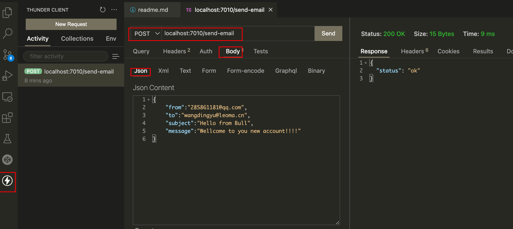

## 本项目为Bull + redis构建的消息队列

#### 说明
1、本项目使用ts构建
2、项目中使用了最新版的bull和bull-board, 在写法和调试的过程中花费了较多的时间
3、需要掌握ts语法及相关类库的基本用法
4、队列ui监控路径：http://localhost:7010/admin/queues/
5、使用vs插件Thunder client代替 postman
6、关于Thunder client的使用